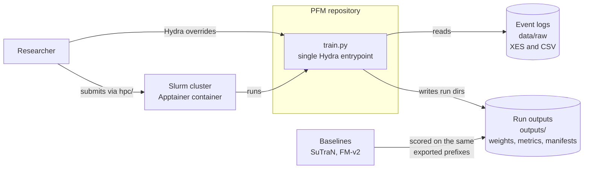
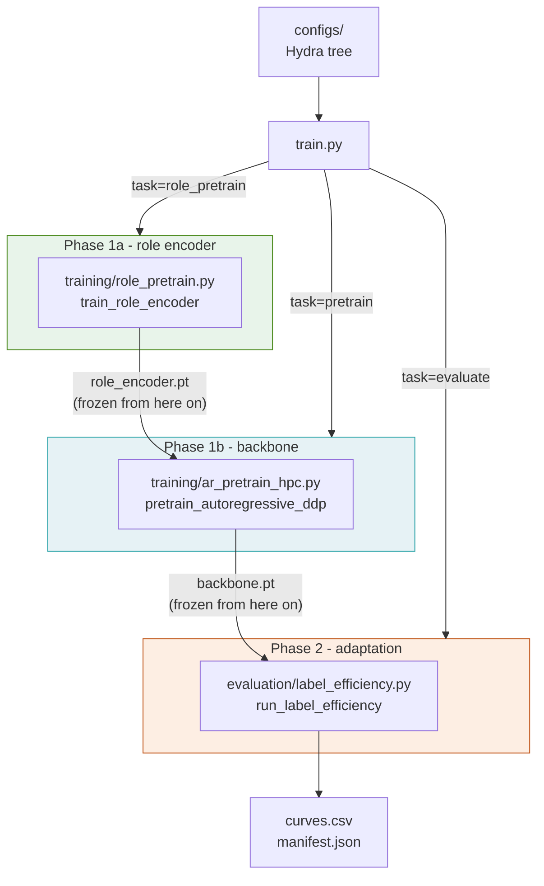
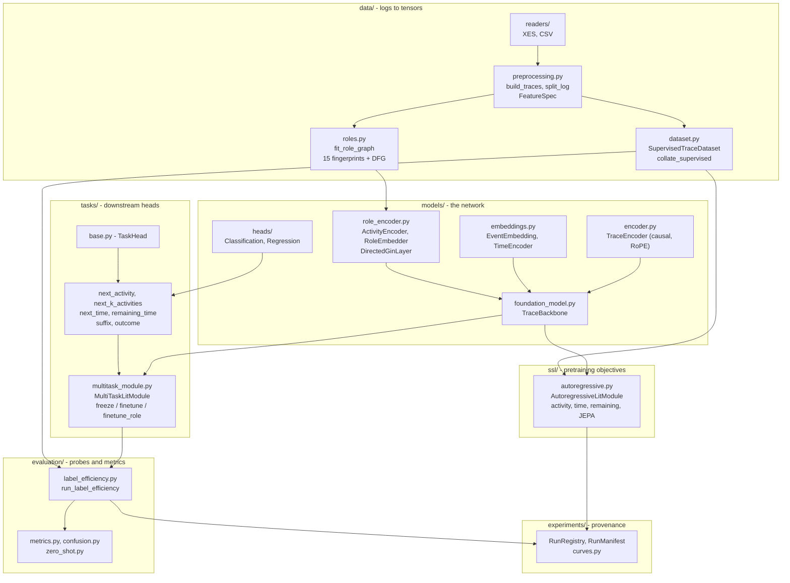
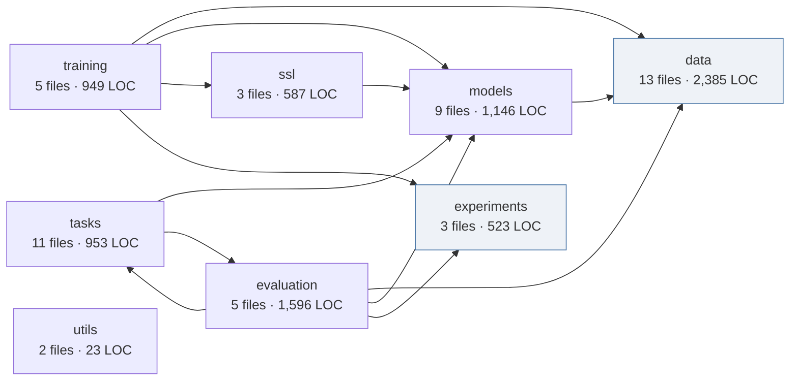

# Architecture

How the codebase is laid out, what depends on what, and where to look for each part of the paper.

**Contents:** [System context](#level-1--system-context) · [Containers](#level-2--containers) ·
[Components](#level-3--components) · [Dependencies](#module-dependency-graph) ·
[Three walkthroughs](#walkthroughs) · [Key abstractions](#key-abstractions) ·
[Where to find things](#where-to-find-things) · [Exploring with CodeGraph](#exploring-with-codegraph)

The diagrams below follow the [C4 model](https://c4model.com): context, then containers, then
components. They render natively on GitHub.

---

## Level 1 - system context



One entrypoint, one config tree. Where a run executes - laptop, one GPU, several nodes - is a config
choice, not a code path.

---

## Level 2 - containers

The three phases of the paper map onto three tasks of the same entrypoint.



The arrows between phases are **artifacts on disk, not imports**. Phase 1b loads a role-encoder run
by id; Phase 2 loads a backbone run by id. That is what makes "frozen" enforceable rather than a
convention - a downstream phase cannot accidentally update an upstream component because it only
ever receives a checkpoint.

---

## Level 3 - components



---

## Module dependency graph

Measured from the import statements, not drawn by hand. Regenerate with the snippet in
[Exploring with CodeGraph](#exploring-with-codegraph).



`data` and `experiments` are leaves - they import nothing else in the package, which is why the
dataset and provenance layers can be used standalone. The one edge that looks like a cycle,
`tasks → evaluation`, is narrow: task heads import `evaluation.metrics` for the shared
`classification_metrics` and `regression_metrics` builders, and nothing else.

The two largest modules are worth knowing about before you go exploring:

| Module | LOC | Why it is big |
|---|---|---|
| `evaluation/label_efficiency.py` | 1,129 | the whole Phase 2 protocol: splits, budgets, seeds, role-catalogue rebuilding, probe training, crash recovery |
| `ssl/autoregressive.py` | 525 | all four pretraining objectives plus the EMA teacher |

---

## Walkthroughs

### A. Pretraining a backbone

```
train.py  _pretrain()
  └─ training/ar_pretrain_hpc.py  pretrain_autoregressive_ddp(cfg)
       ├─ data/readers            get_reader(fmt).read(path)          per log
       ├─ _strip_to_control_flow  keep only activity + timestamp
       ├─ data/preprocessing      build_traces → split_log(TEMPORAL)  70/15/15
       ├─ data/preprocessing      fit_feature_spec                    vocabulary, time stats
       ├─ data/roles              fit_role_graph → apply_aggregator   15 features + DFG
       ├─ models/foundation_model TraceBackbone.from_config
       │    └─ load_pretrained(role_sd)                               frozen Phase 1a encoder
       ├─ ssl/autoregressive      build_autoregressive_module         4 objectives + EMA teacher
       └─ experiments             RunRegistry → backbone.pt, manifest.json, learning_curve.csv
```

### B. Adapting to a held-out log

```
train.py  _evaluate()
  └─ evaluation/label_efficiency.py  run_label_efficiency(cfg)
       ├─ read + strip + build_traces + split_log                     the target log
       ├─ fit_feature_spec(train)          eval vocabulary for TARGETS only
       ├─ fit_role_graph(train or budget)  role_corpus=budget → only the sampled cases
       ├─ for each (task, arm, budget, seed):
       │    ├─ _build_head(...)            linear for activity, MLP for regression
       │    ├─ TraceBackbone.from_config + load_pretrained
       │    ├─ role_encoder.set_graph(...) install the TARGET log's catalogue
       │    ├─ MultiTaskLitModule(freeze_backbone=True)
       │    ├─ Trainer.fit + EarlyStopping + _KeepBestState           best-val restore
       │    └─ Trainer.test → one row
       └─ curves.csv + manifest.json
```

The decisive line is `role_encoder.set_graph(...)`. The *same frozen weights* score a brand-new
activity catalogue, because the encoder consumes fingerprints rather than identities.

### C. How "frozen" is actually enforced

`MultiTaskLitModule` has three modes, and the mode determines what receives gradient:

| Mode | `freeze_backbone` | Trains | Used for |
|---|---|---|---|
| frozen probe | `True` | head only | PFM |
| end-to-end | `False` | everything | PFM-FT |
| partial | `True` + `finetune_role=True` | head + role encoder (9,473 params) | PFM-RFT |

In frozen mode the backbone is put in `eval()` and wrapped in `torch.no_grad()`, so dropout is off
and no gradient is stored. Partial mode keeps `eval()` but drops the `no_grad`, so the loss can reach
the role encoder through a frozen transformer.

---

## Key abstractions

**`TraceBackbone`** (`models/foundation_model.py`) - the reusable representation. Holds an
`EventEmbedding`, a `TraceEncoder`, and a swappable `role_encoder`. Its `forward` computes the role
table `e(a)` once per batch and feeds it to both the embedding and the matching head. Returns an
`EncoderOutput` with `event_states (B, L, d)` and `trace_embedding (B, d)`.

**`TaskHead`** (`tasks/base.py`) - the extension point. A head declares `target_key`, then implements
`forward`, `loss`, `build_metrics` and `update_metrics`. Adding a prediction task means adding one
subclass and one entry in the task table; nothing else changes.

**`FeatureSpec`** (`data/preprocessing.py`) - the encoding contract, persisted per run. Input
encoding uses the *backbone's* spec; categorical targets use the *evaluation log's* vocabulary. That
split is deliberate: it is what keeps cross-log accuracy honest instead of collapsing to "predict
UNK".

**Role graph** (`data/roles.py`) - a dict of `feats (V, 15)`, `adj_in`, `adj_out`, `real_mask`. A log
is fully described to the encoder by this structure, which is why `set_graph` is all that a new log
requires.

**`RunRegistry` / `RunManifest`** (`experiments/`) - every run writes a directory with its full
config, git state and metrics. Collectors in `hpc/collect/` filter on manifest fields, so results can
never silently mix protocols.

---

## Where to find things

| Paper section | Code |
|---|---|
| §3.1 role fingerprints, Table 1 | `data/roles.py` |
| §3.1 GIN role encoder, Eq. 1 | `models/role_encoder.py` - `DirectedGinLayer`, `ActivityEncoder` |
| §3.1 role losses | `training/role_pretrain.py` |
| §3.2 backbone | `models/encoder.py`, `models/embeddings.py` |
| §3.2 pretraining objectives, Eq. 4 | `ssl/autoregressive.py` |
| §3.3 task heads | `tasks/*.py`, `models/heads/` |
| §4.1 splits, budgets, protocol | `evaluation/label_efficiency.py` |
| §4.2 metrics | `evaluation/metrics.py` |
| Ablation variants | `configs/model/role_*.yaml` (`latent0` and `norole` are `role_gin15` plus `ar.jepa_weight=0` / `model.role_dim=0`, not their own configs) |

## Exploring with CodeGraph

The repository is indexed, so a single query returns the relevant source plus the call paths between
symbols:

```bash
codegraph explore "how does run_label_efficiency build a task head and train it"
codegraph explore "TraceBackbone forward and where the role table is used"
```

To regenerate the dependency graph above after a refactor:

```bash
python - <<'EOF'
import ast, os, collections
pkg = collections.defaultdict(lambda: [0, 0, set()])
for dp, _, fs in os.walk("src/pm_foundation"):
    for f in (f for f in fs if f.endswith(".py")):
        p = os.path.join(dp, f)
        mod = p[len("src/"):-3].replace("/", ".").replace(".__init__", "")
        sub = mod.split(".")[1] if "." in mod[len("pm_foundation"):] else mod
        src = open(p).read()
        pkg[sub][0] += 1
        pkg[sub][1] += len(src.splitlines())
        for n in ast.walk(ast.parse(src)):
            m = n.module if isinstance(n, ast.ImportFrom) else None
            if m and m.startswith("pm_foundation"):
                d = m.split(".")[1] if len(m.split(".")) > 1 else m
                if d != sub:
                    pkg[sub][2].add(d)
for k in sorted(pkg, key=lambda k: -pkg[k][1]):
    n, loc, deps = pkg[k]
    print(f"{k:<12} {n:>3} files {loc:>6} LOC  ->  {', '.join(sorted(deps)) or '-'}")
EOF
```
