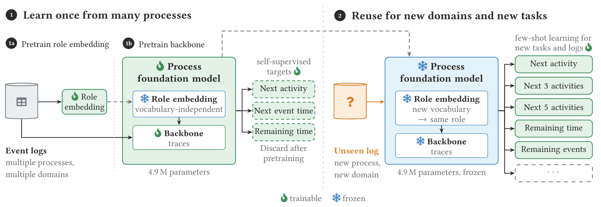
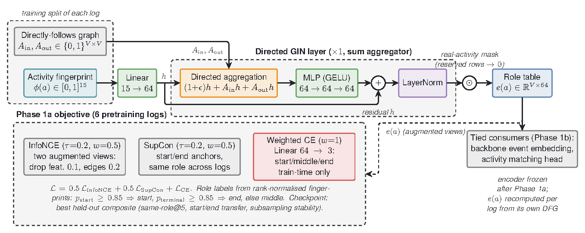
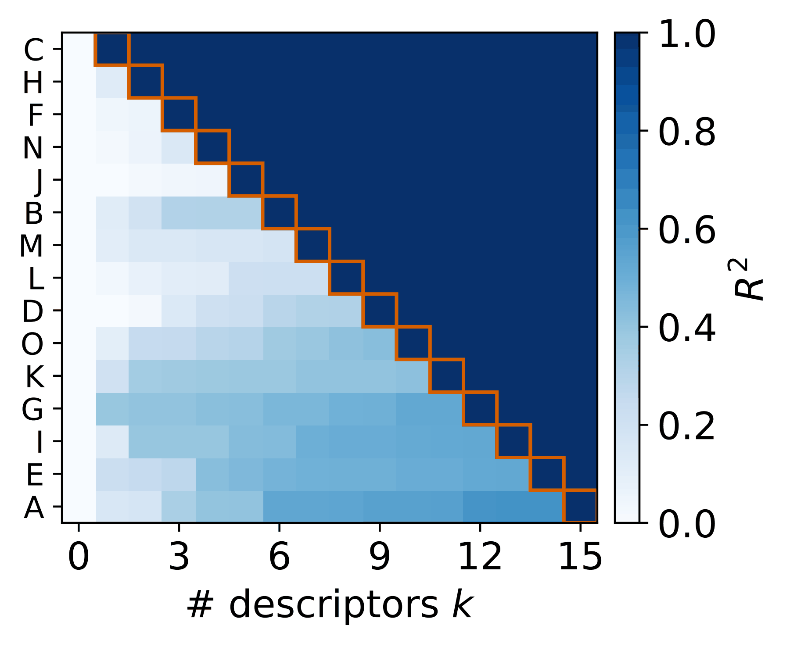
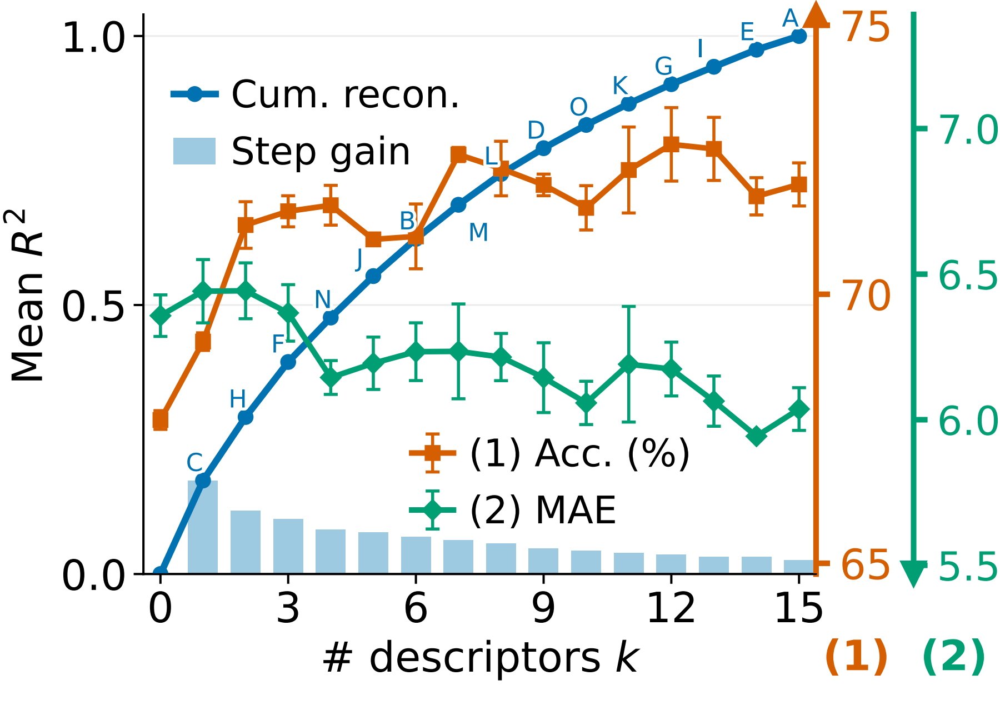
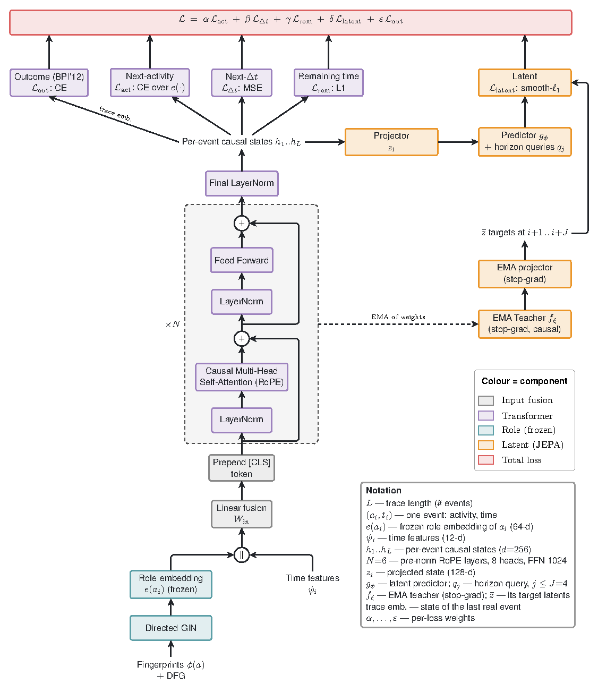
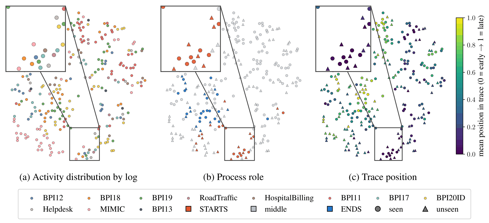
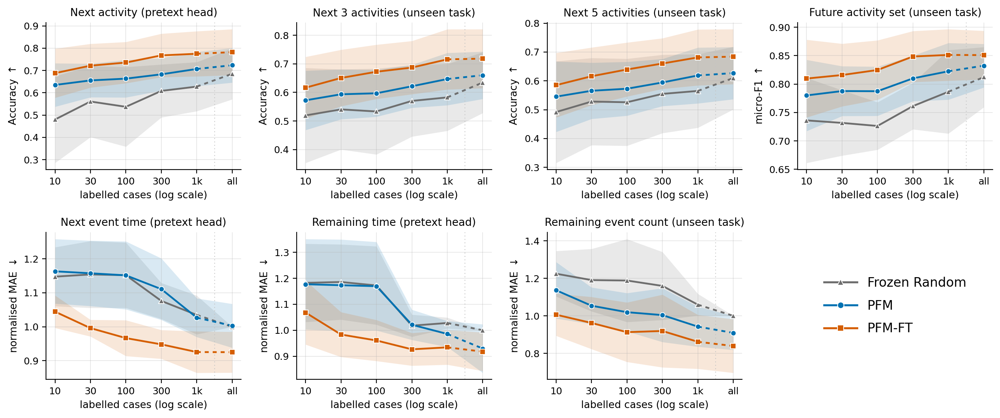
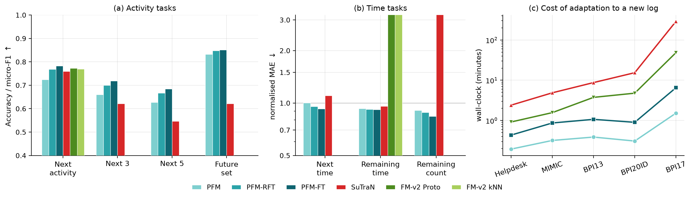

# PFM - A Process Foundation Model with Reusable Process Representations

Reference implementation for the paper *"PFM: A Process Foundation Model with Reusable Process
Representations for Predictive Process Monitoring"* (Tran, Wölker, Landsiedel - TUHH).

| | |
|---|---|
| **Reproduce the experiments** | [REPRODUCE.md](REPRODUCE.md) |
| **Understand the codebase** | [ARCHITECTURE.md](ARCHITECTURE.md) |
| **Result data behind every number** | [`results/`](results/) |
| **Scripts that produced them** | [`scripts/`](scripts/) |
| **Datasets, baselines, licences** | [REFERENCES.md](REFERENCES.md) |

---

## The problem

A predictive process monitoring (PPM) model is normally trained for **one event log and one
prediction task**. Change the activity vocabulary, the process, or the target, and you retrain.
That is because most models embed activities by their **identity** - a lookup table indexed by
activity ID. Those IDs mean nothing in a log the model has never seen.

PFM asks what happens if the reusable artifact is the **event-state representation itself**, shared
across both axes: new logs *and* new tasks.

## The idea

Describe an activity by **what it does in the process**, not by what it is called.

> "The thing that usually starts a case, rarely repeats, has two typical successors, and is followed
> about four hours later" is a description that transfers to a log whose activity names you have
> never seen.

Concretely, each activity gets a 15-dimensional **fingerprint** of structural, temporal and
positional descriptors computed from the directly-follows graph (DFG). A frozen encoder turns that
fingerprint plus one hop of graph context into a **role embedding**. A causal transformer consumes
role embeddings and event times. Neither component is updated for a new log.



Three phases, and the first two happen exactly once:

| Phase | What it learns | Frozen afterwards? |
|---|---|---|
| **1a - Role embedding** | maps a fingerprint + DFG context to a vocabulary-free activity vector | yes |
| **1b - Backbone** | causal transformer over role embeddings and time, trained on six logs | yes |
| **2 - Adaptation** | one lightweight head per task, on the target log | the head is all that trains |

Because the vocabulary never enters the model, the 683 activity names in the pretraining corpus
**do not overlap at all** with the five held-out evaluation logs. There is nothing to look up.

---

## How it works

### Phase 1a - role embeddings



Each activity `a` in log `ℓ` gets a fingerprint `x_ℓ(a) ∈ R¹⁵`, rank-normalised inside its weakly
connected DFG component so the values are comparable across logs of very different size.

| Family | Descriptors |
|---|---|
| Graph centrality | PageRank, betweenness |
| Control-flow structure | self-loop probability, case-start and case-end probability, case coverage, repetition rate |
| Branching entropy | predecessor and successor entropy |
| Temporal performance | median and spread of incoming and outgoing delays |
| Position in case | mean and spread of relative event position |

A one-layer residual GIN-style encoder adds one hop of DFG context:

```
e_ℓ(a) = LayerNorm( x̃_ℓ(a) + MLP_role( (1+ε)·x̃_ℓ(a) + Σ_{b ∈ N⁻(a)} x̃_ℓ(b) + Σ_{b ∈ N⁺(a)} x̃_ℓ(b) ) )
```

Training combines InfoNCE across two augmented views of the same activity, supervised contrastive
and classification terms over coarse start/end roles. All statistics come from training traces only.

**How many of the 15 descriptors are needed?** The order is fixed before any training run, by
sequential greedy **Principal Variables Analysis (PVA)** on the correlation matrix of the pretraining
logs, so it never sees a downstream label. One role encoder and one backbone are then pretrained per
budget `k = 0..15` and probed frozen on the five held-out logs (Figure 4a-b of the paper):

<p align="center">
  
  
</p>

PVA takes the self-loop probability first, then predecessor entropy and case coverage; PageRank is
taken last, being the descriptor the other fourteen reconstruct best. Five descriptors rebuild 55% of
the full fingerprint and seven rebuild 69%. Downstream the curve flattens well before the
reconstruction does: next-activity accuracy is 67.7% with no fingerprint at all (DFG topology only),
71.3% at two descriptors and 72.6% at seven, against 72.0% for all fifteen, while remaining-time MAE
improves by about 5% over the same range. The pre-registered near-full budget is `k = 7`. Which
descriptors matter most is task-dependent, so this is a reconstruction ordering, not an importance
ranking.

### Phase 1b - backbone pretraining



A causal, pre-norm transformer with rotary position embeddings, 6 layers, `d_model = 256`. Its input
is the frozen role embedding concatenated with time features. It is trained on six heterogeneous
logs with four objectives: next activity, next event time, remaining time, and a **future-latent**
(JEPA-style) objective that predicts its own EMA-teacher states `J = 4` steps ahead.

### Phase 2 - adaptation

The role encoder and backbone stay frozen. For a new log you need only its **activity set, DFG and
fingerprints**, computed from the labelled cases you have. One head per task reads the causal event
state `h_i`:

- four activity tasks use a **single linear layer** - so the metric measures what is *linearly
  decodable* from the frozen state;
- three regression tasks use a small `Linear–GELU–Linear` MLP with hidden dimension 128.

Heads are independent. Adding, replacing or removing one changes nothing else.

---

## Does the representation actually transfer?

If role embeddings were log-specific, activities from held-out logs would form their own island. They
do not. One shared t-SNE over 266 activities from all eleven logs:



Panel (a) colours by source log, (b) by process role, (c) by mean position in the case. Held-out
activities (triangles) sit interleaved with pretraining activities (circles). The zoom window holds
9 pretrained and 9 held-out case-openers in the same small region, and panel (c) confirms
independently that they really are early-in-case events.

---

## Results

Five held-out logs, seven tasks, three seeds. `Frozen Random` is a randomly initialised, frozen
representation - the honest floor. `PFM` freezes everything and trains only heads. `PFM-FT`
fine-tunes end to end and is the upper reference, not a competitor. `PFM-Scratch` is the same
architecture trained end to end from random init, i.e. what the design is worth without pretraining.

Means over the five held-out logs at full supervision, recomputed from [`results/v2_all.csv`](results/v2_all.csv).
The PFM column is the arm published in Table 5 of the paper (`pfm_s2`, the seed-2 pretrained backbone);
PFM-FT is `pfm_ft` (seed 0), as published. `figures/make_table5.py` regenerates the per-log table:

| Task | Frozen Random | PFM-Scratch | PFM (frozen) | PFM-FT |
|---|---|---|---|---|
| Next activity (acc) | 0.685 | **0.787** | 0.733 | 0.782 |
| Next 3 activities (acc) | 0.635 | **0.724** | 0.673 | 0.718 |
| Next 5 activities (acc) | 0.610 | **0.691** | 0.639 | 0.684 |
| Future activity set (F1) | 0.812 | **0.857** | 0.831 | 0.851 |
| Next event time (norm. MAE) | 1.000 | 0.952 | 0.984 | **0.925** |
| Remaining time (norm. MAE) | 1.000 | 0.957 | 0.937 | **0.918** |
| Remaining count (norm. MAE) | 1.000 | 0.967 | 0.903 | **0.839** |

MAE tasks are divided by that log's Frozen Random error at full supervision, so lower than 1.0 beats
the floor. PFM-FT leads PFM-Scratch at every budget from 10 to 1,000 labelled cases (0.675 vs 0.657
at 10, 0.718 vs 0.678 at 100, mean over the four activity tasks); with every case labelled the two
meet and PFM-Scratch edges ahead by half a point. Pretraining buys the initialisation, and its value
is largest exactly where labels are scarce. Per-log numbers are Table 5 of the paper and are
reproducible from the same CSV.

### Label efficiency



At **ten labelled cases** the frozen representation already beats Frozen Random on all four activity
tasks. The budget axis is logarithmic; `all` is the full training partition, which is a different
size per log, so that last hop is marked with a break symbol (//) rather than drawn as a normal step.

The time panels start flat for every arm until roughly 300 labels. That is a property of the data
and the budget, not of head capacity - we checked by rerunning all three regression tasks with a
**linear** head instead of the MLP, on all five logs, and the floor does not move
([`results/linhead_all.csv`](results/linhead_all.csv)).

### Accuracy against baselines, and what adaptation costs



Against **SuTraN**, which is trained separately per target log, the two are close: per-setting values are
in [`results/sota_agg_data.csv`](results/sota_agg_data.csv), and `figures/make_table5.py` prints the same
table as the paper. Against **FM-v2** neither method dominates on the two tasks it supports.

Panel (c) is the part the paper leads with. Adapting to a new log and scoring its test partition, on
one NVIDIA H200, for the two tasks every method supports:

| Log | PFM | PFM-FT | PFM-Scratch | FM-v2 | SuTraN |
|---|---|---|---|---|---|
| Helpdesk | **0.19** | 0.43 | 0.38 | 0.92 | 2.40 |
| MIMIC-5k | **0.32** | 0.87 | 1.15 | 1.57 | 4.87 |
| BPI13 | **0.39** | 1.07 | 0.93 | 3.75 | 8.73 |
| BPI20ID | **0.31** | 0.90 | 1.08 | 4.77 | 15.38 |
| BPI17 | **1.52** | 6.52 | 16.03 | 48.52 | 289.57 |

Minutes. PFM's figure uses **cached features**: because the backbone is frozen its states do not
depend on head weights, so it is encoded once per log and every head trains from the cache. That
reaches identical test metrics (max difference 0.009 accuracy) and is 3.1× to 20.7× faster than
re-running the backbone each epoch. Measurements: [`results/timing_pinned.csv`](results/timing_pinned.csv),
[`results/cached_pfm_bench.jsonl`](results/cached_pfm_bench.jsonl).

---

## Data

Eleven event logs, all public except MIMIC-IV which requires credentialed access.

| Phase | Logs |
|---|---|
| Pretraining | BPI12, BPI19, BPI18, Road Traffic, BPI11, Hospital Billing |
| Held-out evaluation | BPI17, BPI20ID, MIMIC, BPI13, Helpdesk |

Every log goes flat in `data/raw/` under a specific name, and the downloads do **not** arrive with
those names. [REPRODUCE.md](REPRODUCE.md#2-data) has the full rename table, and
`python scripts/check_data.py` tells you exactly what is missing or misnamed before you spend any
GPU time.

Raw statistics including mean inter-event time and mean case duration are in
[`results/log_stats.csv`](results/log_stats.csv), regenerable with `python scripts/log_stats.py`.

---

## Quick start

```bash
uv sync                      # or: pip install -e .
uv run python train.py task=role_pretrain role=frozen trainer=local
```

That trains the Phase 1a role encoder in the paper's configuration: `role=frozen` trains on the six
pretraining logs and selects the checkpoint on Sepsis and Receipt, which are never trained on.

Full instructions, including how to get each log and how to reproduce every table and figure, are in
[REPRODUCE.md](REPRODUCE.md).

## Citation

```bibtex
@article{tran2026pfm,
  title   = {{PFM}: A Process Foundation Model with Reusable Process Representations
             for Predictive Process Monitoring},
  author  = {Tran, Trinh and W{\"o}lker, Yannick and Landsiedel, Olaf},
  journal = {Manuscript submitted to ACM},
  year    = {2026}
}
```

If you use the event logs, **cite the log authors too** - see
[REFERENCES.md](REFERENCES.md#event-logs). The code is licensed under [LICENSE](LICENSE); that
covers the code only, not the datasets, which carry their own terms.
